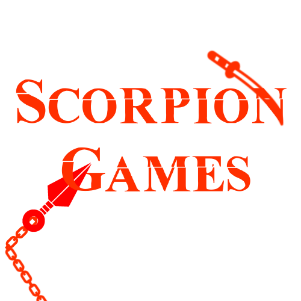

### Site da Loja de Jogos Scorpion Games


Um projeto feito em React com integrações com API Nodejs e Banco de Dados.

## Sumário

- [Introdução](#introdução)
- [Funcionalidades](#funcionalidades)
- [Uso](#uso)

## Introdução

Um site para venda e compra de jogos onde o vendedor pode fazer o cadastro e listagem dos seus jogos, e o comprador pode encontrar os itens cadastrados na loja, além disso os usuários podem fazer criticas e enviar fotos das suas gameplays ou conteúdo relacionado ao jogo.


## Funcionalidades

- Funcionalidade 1: Accordions no menu inicial do site.

- Funcionalidade 2: Formulário de cadastro de jogos.

- Funcionalidade 3: Página de listagem de jogos cadastrados.


## Funcionalidades em desevolvimento
- Funcionalidade 1: Página para comprar jogos.
- Funcionalidade 2: Envio de critícas e imagens.
- Funcionalidade 3: Página de favoritos.

## Uso

Clone o repositório e instale as dependências necessárias:

```bash
git clone https://github.com/MatheusSikeira/Loja-de-Jogos-Front-End.git
cd seu-projeto
npm install
npm start
